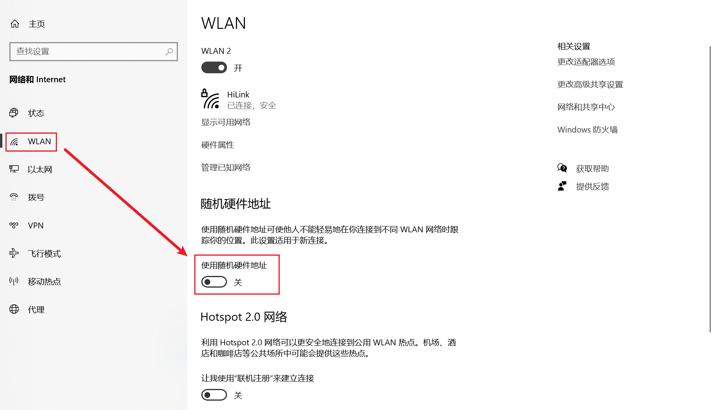
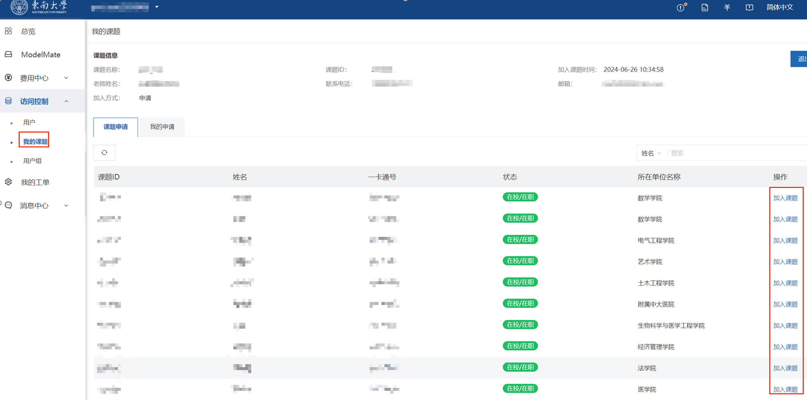

### 华为昇腾服务器使用指南

创建者：FATT

日期：2024年8月6日21:57:42

版本：1.1.0

声明：该文档仅用于HIQC课题组内交流，文档中图片可能涉及隐私秘密，切记不得外传。

#### 0 前置准备

在进行以下操作之前，确保你已经连接到东大校园网，如果你在校外，请通过Easy Connect连接VPN后继续下述操作。


在校外网络环境下，如果使用VPN时仍无法打开算力平台登录页面，可以尝试以下几种解决方案，**建议将以下方案全部操作一遍**。

1. 如果你有其他代理软件，请先关闭代理软件，并打开设置-->网络与Internet,点击图中所示代理，将其关闭

   

2. 如果你通过WLAN连接网络，请打开设置-->WLAN，检查随机硬件地址状态，如果开启则将其关闭。

   

3. 打开设置-->WLAN-->更改适配器选项，找到你的无线网卡（即显示绿色信号格的设备），右键唤出控制列表，点击属性，然后按照图示顺序配置IP地址和DNS服务器为自动获取（多数情况下无法访问是由于用户**自定义配置了DNS服务器**）。

   

   

   完成上述操作后，win+R快捷键打开运行窗口，输入cmd然后回车，在命令行中输入 ipconfig /flushdns刷新DNS服务器信息。

   

#### 1  访问学生算力平台

1. ##### 打开浏览器**，访问 https://aiuconsole.seu.edu.cn/**

2. ##### 自动跳转至**东南大学身份认证中心**（如果无法连接，参考0 前置准备章节），输入一卡通号和密码，选择登录，登录成功后会自动跳转至算力运营平台

   

3. ##### 加入老师的课题

   1. 如果此时学生未加入任何课题，登录后会看到弹窗提醒，此时用户仅能点击“去我的课题”按钮，到我的课题页面，提交加入课题申请。

      

   2. 在我的课题申请页面，检索老师姓名，在右侧点击加入课题按钮，提交加入课题申请。然后将申请页面截图发送给老师，提醒老师接受你的申请。

      

#### 2 使用ModelMate算力

1. ###### 课题申请通过后，需要重新登录到平台。

   切换到指定课题后，点击左侧ModelMate菜单，在右侧页面点击页面上方的“ModelMate控制台”按钮，即可跳转ModelMate AI服务平台使用AI智算算力。

   

2. ###### 开发环境选择与配置

   

   点击操作选项中的修改可以修改引擎（训练环境），规格（CPU，GPU和NPU，内存等资源）和SSH登录接口（允许VSCode远程开发）。

   

3. ###### Notebook开发。

   VScode和Pycharm的远程开发参见官方文档： [使用本地IDE开发算法(2).chm](assets\使用本地IDE开发算法(2).chm) 

   

   此处以Notebook开发为例，点击进入notebook文件夹，然后点击+号，唤出Launcher页面，点击Python3(ipykernel)即可创建一个空的Notebook文件。以下是一个华为给的demo:

    [Demo.ipynb](assets\Demo.ipynb) 

   依赖包的导入
   可以使用 import导入整个包，也可以使用from ** import *** 导入某个包里的特定函数或类

   ```python
   # Import Module
   from numpy import loadtxt # 从numpy库中导入loadtxt函数
   from tensorflow.keras.models import Sequential # 从tensorflow.keras.models模块中导入Sequential类
   from tensorflow.keras.layers import Dense
   
   from manas.model2.metadata.model_spec import ModelSpec
   from manas.model2.metadata.ParameterBuilder import ParameterBuilder
   from manas.model2.metadata.metadataBuilder import MetaDataBuilder
   from manas.model2 import repository  as model2
   ```

   定义数据集读取函数，这里的示例为文本序列数据。

   ```python
   def read_dataset(data_path):  # data_path: str，数据集文件的路径
       # Data reading
       dataset = loadtxt(data_path, delimiter=',')
       x = dataset[:,0:8] # x: numpy.ndarray，特征
       y = dataset[:,8] # y: numpy.ndarray，标签
       return x, y
   ```

   定义模型训练函数

   ```python
   def train_model(x, y):
       # Train Model
       model = Sequential() # 定义模型为Sequential类模型
       model.add(Dense(12, input_shape=(8,), activation='relu')) # 添加输入层和第一个隐藏层，8个输入节点，12个隐藏层节点，激活函数为ReLU
       model.add(Dense(8, activation='relu')) # 添加第二个隐藏层，8个隐藏层节点，激活函数为ReLU
       model.add(Dense(1, activation='sigmoid')) # 添加输出层，1个节点，激活函数为sigmoid
       model.compile(loss='binary_crossentropy', optimizer='adam', metrics=['accuracy'])  # 编译模型，使用binary_crossentropy损失函数，优化器为adam，评估指标为accuracy
       model.fit(x, y, epochs=50, batch_size=10) # 训练模型，迭代50次，每批次10个样本
       return model
   ```

   定义模型评估函数

   ```python
   def evaluate_model(model, x, y): 
       # Evaluating model
       score = model.evaluate(x, y) # 调用Sequential类自带的evaluate函数
       return score
   ```

   定义模型保存函数

   ```python
   def save_model(model, save_path):
       # Save Model
       model.save(save_path) # 保存模型到指定路径
   ```

   定义模型注册函数

   ```python
   def register_model(save_path): # 注册模型到模型管理平台
       # Registering Model
       model_spec = ModelSpec.Builder().name("keras_demo").type("tensorflow-pb").model_version("1.0.1").build()
       metadata = MetaDataBuilder().model_spec(model_spec).build()
       param = ParameterBuilder().model(save_path).metadata(metadata).build()
       result = model2.modelRegister(param)
       return result
   ```

   主程序

   ```python
   print("[MANAS] ---> get train dataset and predict dataset")
   local_file = "/dls/app/input/tensorflow_demo_data.csv"
   x, y = read_dataset(local_file)
   
   print("[MANAS] ---> train model")
   model = train_model(x, y)
   
   print("[MANAS] ---> evaluate model")
   result = evaluate_model(model, x, y)
   print("evaluate result:", result)
   
   print("[MANAS] ---> do save model")
   save_path = "/dls/app/model/keras_demo/"
   save_model(model, save_path)
   
   print("[MANAS] ---> register model")
   register_model(save_path)
   
   print("[MANAS] ---> Manas training end")
   ```

   

   > [!IMPORTANT]
   >
   > 注意，Jupyter将代码分割成了许多代码块，这类似于pycharm或者vscode编辑器的代码文件树；在pycharm或者vscode中，多个python文件之间可以通过import相互调用，Jupyter也支持调用python文件中的函数或类。但如果参照上述流程编写代码，至少需要将定义函数的单元格运行一次，Jupyter编辑器才可以将其纳入可用资源池；如果对函数单元格进行了修改，也需要重新运行一次。

4. ###### 数据集读写；模型读写。

   > [!WARNING]
   >
   > 数据集和模型必须从指定路径读取和写入；
   >
   > 数据集的读写路径需联系管理员（@赵涛涛@刘济源）获取。

   > [!NOTE]
   >
   > 不支持个人上传数据集到 Jupyter Notebook工作区，需联系数据集管理员（@赵涛涛@刘济源）上传

   

   在Notebook的ipynb文件中读取数据集示例 从/opt/dpcvol/datasets路径下读取对应数据集，读取方式和读取本地文件一致，如下示例为使with open方式读取数据集

   ```python
   file_path = '/opt/dpcvol/datasets/从管理员处查询到的数据集ID'
   with open(file_path, 'r') as file: 
       data = file.read()
   ```

   > [!CAUTION]
   >
   > 如果涉及对原始数据集的清洗，转换，请不要直接覆盖原始数据集，应当将转换后的数据集保存在与原始数据同级目录的新建文件夹下。

   

   在Notebook的pynb文件中读取模型文件，/opt/dpcvol/models路径下读取对应模型文件，读取方式和读取本地文件一致，如下示例为使with open方式读取模型文件。

   ```python
   file_path = '/opt/dpcvol/models/xxx'
   with open(file_path, 'r') as file: 
       data = file.read()
   ```

   > [!CAUTION]
   >
   > 模型保存时应注意在模型名称中著明模型名称模型版本模型性能以及日期等参数，方便调用
   >
   > 例如 MobileNet_v1_95_240805.tf，这是一个MobileNet的v1版本模型，在测试数据集上的准确率为95，创建于2024年8月5日，为Tensorflow格式的模型文件。

5. ###### 在Notebook中安装外部包（自定义包）

   在Notebook中通过在首行添加‘！’即可快速切换命令行模式，然后可以通过pip3安装所需要的外部包。

   1. 查看当前环境中已有的包

   ```python
   ! pip3 list
   ```

   

   2. 查看特定包的版本

   ```python
   ! python --version
   ! pip3 show numpy
   ```

   

   3. 基于python语言编写和打包的py,tar.gz,whl文件,需要将其上传至Notebook的lib/py目录Notebook中使用方式如下：

   - py格式的文件，上传完后,Notebook中直接引用即可。

   - tar.gz或whl格式的文件上传完后,Notebook中需要通过如下命令调用:

     ```python
     !pip install --no-index  xxx
     ```

   

   
